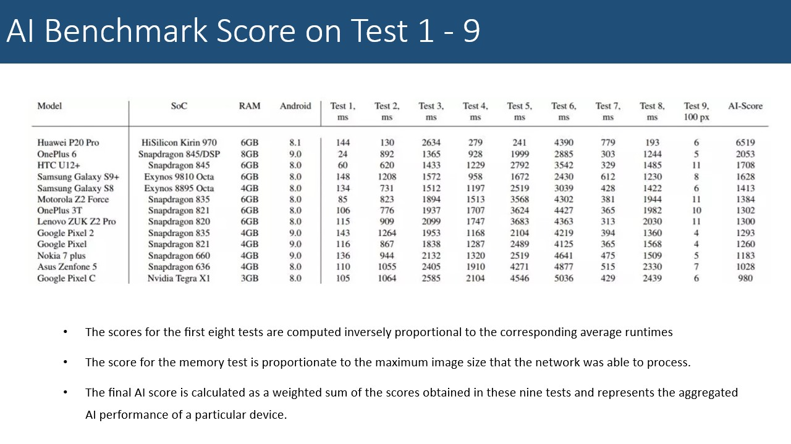
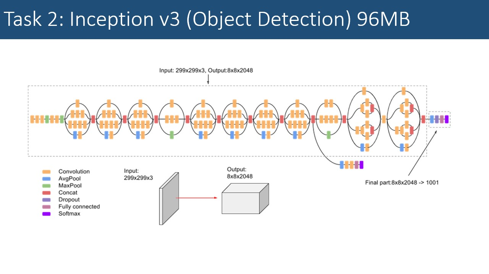
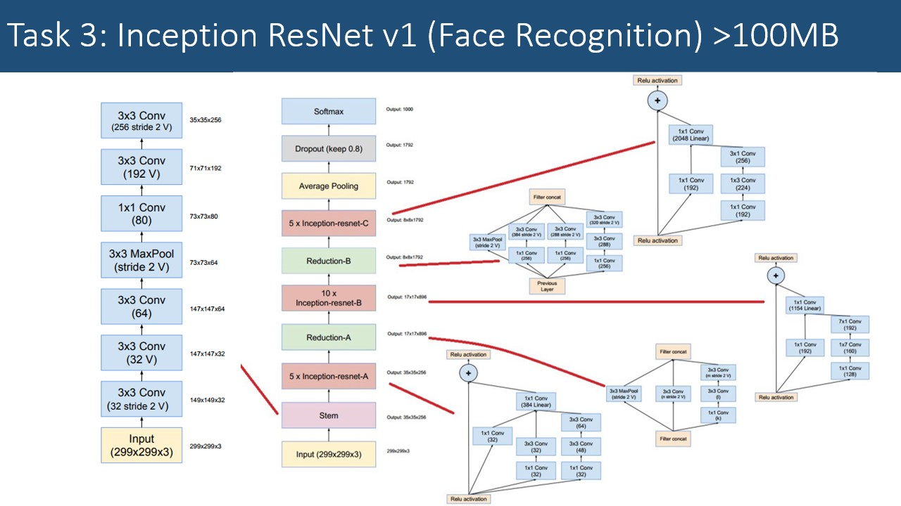
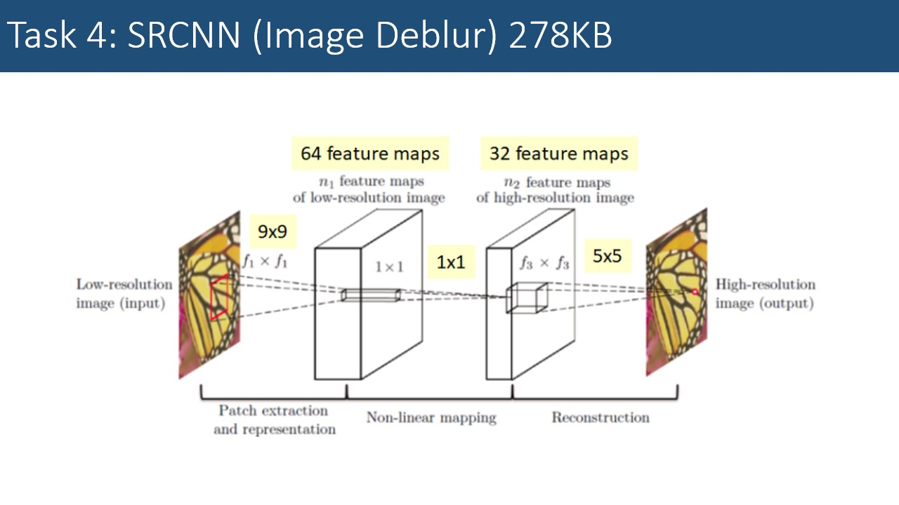
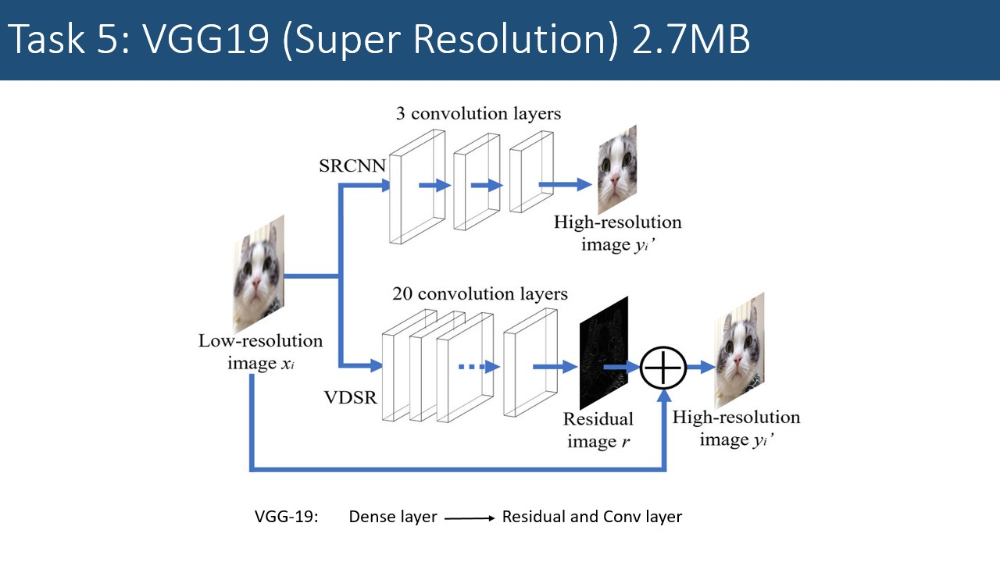
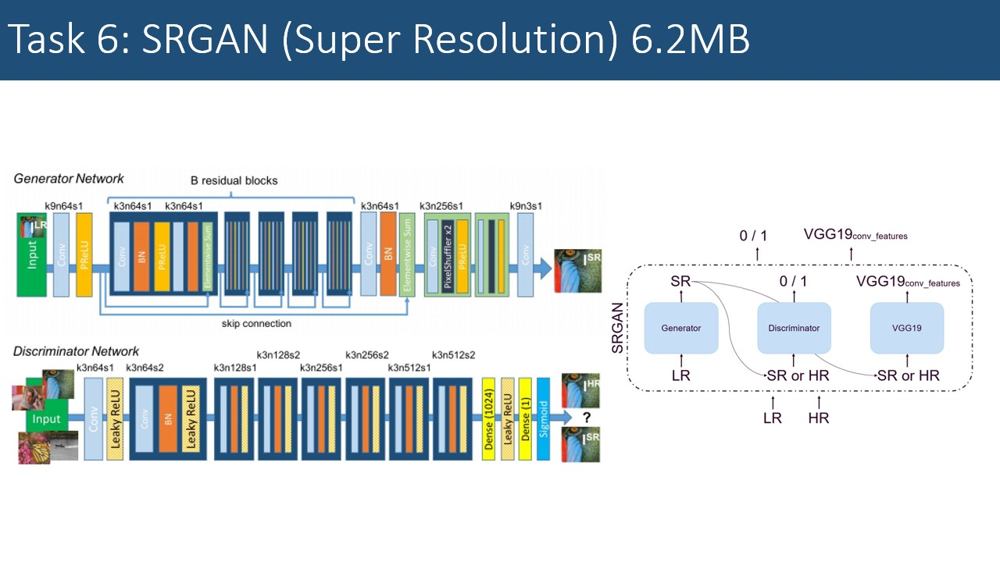
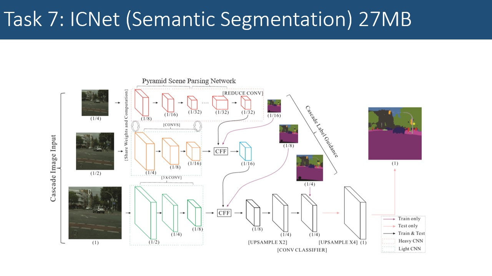
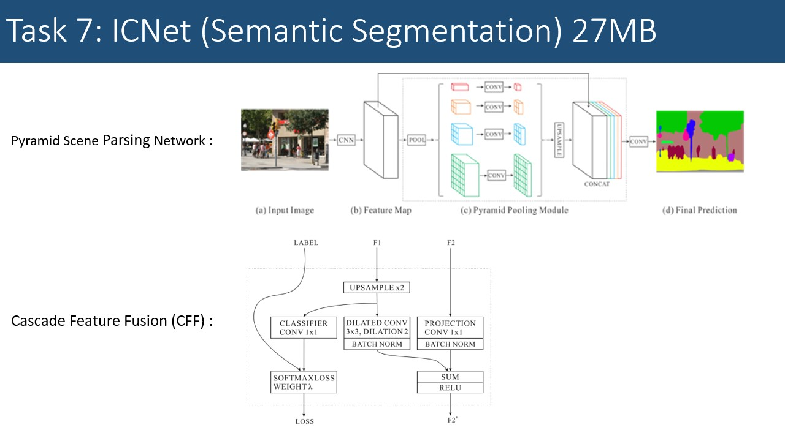
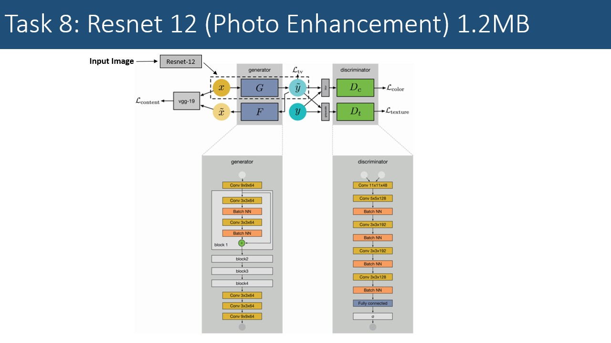

Create models in AI benchmark http://ai-benchmark.com/tests.html

The benchmark consists of 11 Computer Vision AI tasks performed by 10 separate Neural Networks that are running on your android smartphone.

Object Detection: Mobile-v2, Inception-v3

Face Recognition: Inception-Resnet-v1

Super Resolution: SRCNN, VDSR, SRGAN, Resnet-12+GAN

Semantic Segmantation: ICNet

Mobile-v2: A very small yet already powerful neural network that is able to recognize 1000 different object classes based on a single photo with an accuracy of ~72%. After quantization its size is less than 4Mb, which together with its low RAM consumption allows to lanch it on almost any currently existing smartphone.

Inception-v3: A different approach for the same task: now significantly more accurate, but at the expense of 4x larger size and tough computational requirements. As a clear bonus - can process images of higher resolutions, which allows more accurate recognition and smaller object detection.

Inception-Resnet-v1: This task probably doesn't need an introduction: based on the face photo you want to identify the person. This is done in the following way: for each face image, a neural network produces a small feature vector of size 128 that encodes the face and is invariant to its scaling, shifts and rotations. Then this vector is used to retrieve the most similar vector (and the respective identity) from your database that contains the same information about hundreds or millions of people. 

SRCNN: Remember taking blurry photos using your phone camera? So, this is the task: make them sharp again. In the simplest case, this kind of distortions is modeled by applying a Gaussian blur to uncorrupted images, and then trying to restore them back using a neural network. In this task, blur is removed by one of the oldest, simplest and lightest neural networks - by SRCNN with only 3 convolutional layers, though in this case it still shows quite satisfactory results.

VDSR(Modified from VGG19): Have you ever zoomed you photos? Remember artifacts, lack of details and sharpness? Then you know this task from your own experience: make zoomed photos look as good as the original images. In this case, the network is trained to do an equivalent task: to restore the original photo given its downscaled (e.g. by factor of 4) version. Here we consider a deep VGG-19 network with 19 layers. While its performance is currently not amazing and it is not able to reconstruct high-frequency components, it is still an ideal solution for paintings and drawings: it makes them sharp but smooth.

SRGAN: The same task, but with new tricks: what if we train our neural network using... another neural network? Yes, two network performing two tasks: network A is trying to solve the same super-resolution problem as above, but network B observes its results, tries to find there some drawbacks and then penalizes network A. Sounds cool? In fact it is cool: while this approach has its own issues, the produced results are often looking really amazing.

ICNet: Running Self-Driving algorithm on your phone? Yes, that's possible too, at least you can perform a substantial part of this task – detect 19 categories of objects (e.g. car, pedestrian, road, sky, etc.) based on the photo from the camera mounted inside the car. In the right image you can see the results of such pixel-size segmentation (each color correpsonds to each object class) for a quite recent ICNet network designed specifically for low-performance devices.

Resnet-12 + GAN: Still struggling when looking at photos from your old phone? This can be fixed: a properly trained neural network can make photos even from an ancient iPhone 3GS looking nice and up-to-date. To do this, it observes and learns how to transform photos from a low-quality device into the same photos from a DSLR camera. Of course there are some obvious limits for this magic (e.g. the network should be retrained for each new phone model), but the resulting images are looking quite good, especially for old devices.

Reference: http://ai-benchmark.com
